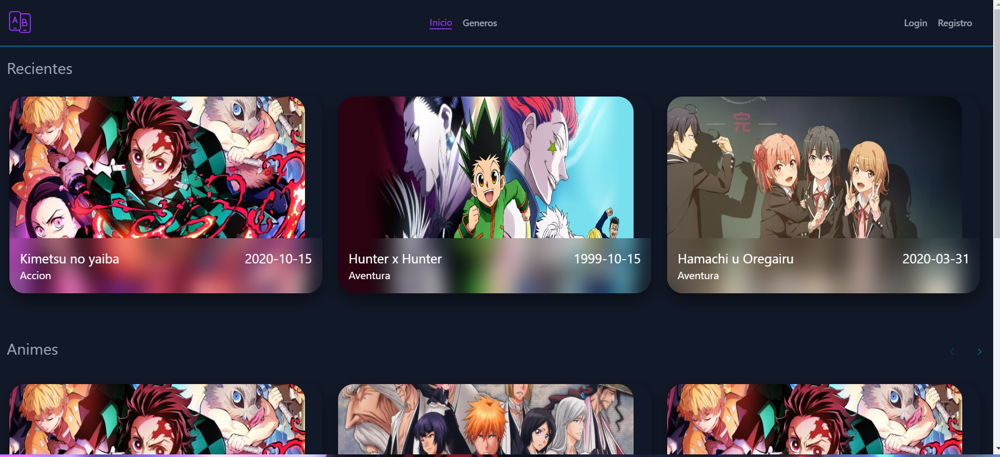
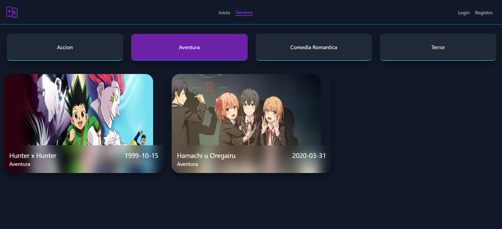
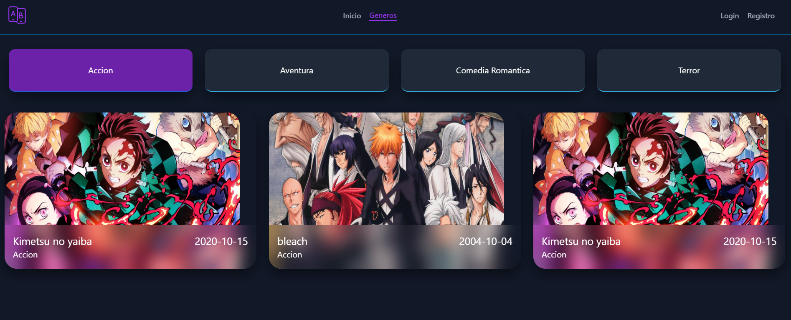
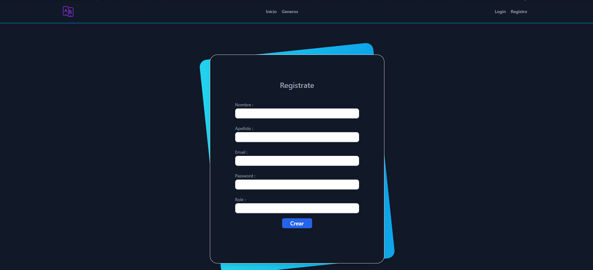
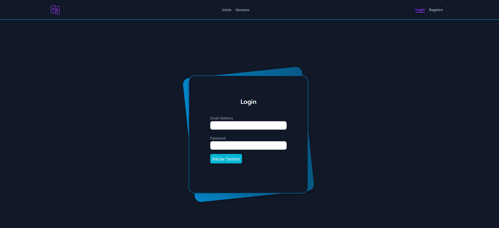
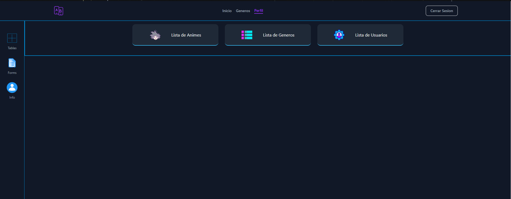
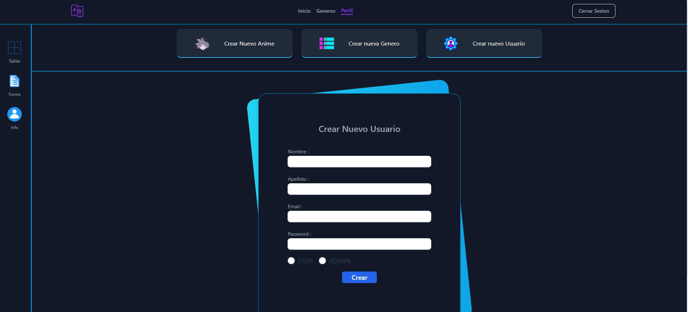
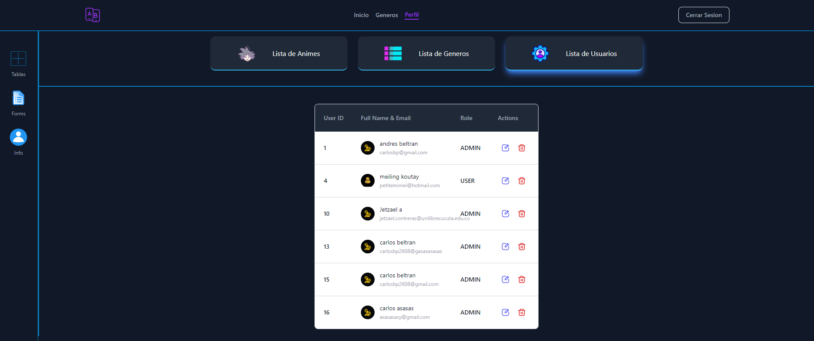
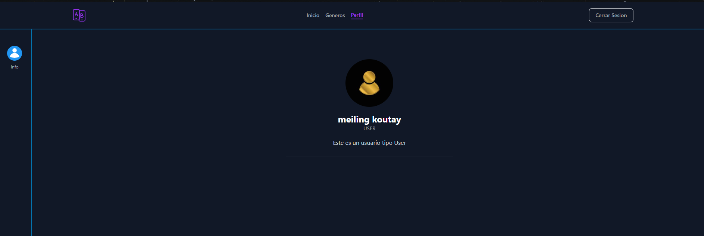

# AnimeFront

Este proyecto tiene como consumo Apis que vienen del baackend de este proyecto el cual permitira el acceso a la base de datos Mysql

# Tecnologias

- autenticacion con JWT
- Back con Spring Boot
- Front con Angular y Tailwind css

## Imagenes

This project was generated with [Angular CLI](https://github.com/angular/angular-cli) version 18.2.1.

## Further help

To get more help on the Angular CLI use `ng help` or go check out the [Angular CLI Overview and Command Reference](https://angular.dev/tools/cli) page.
